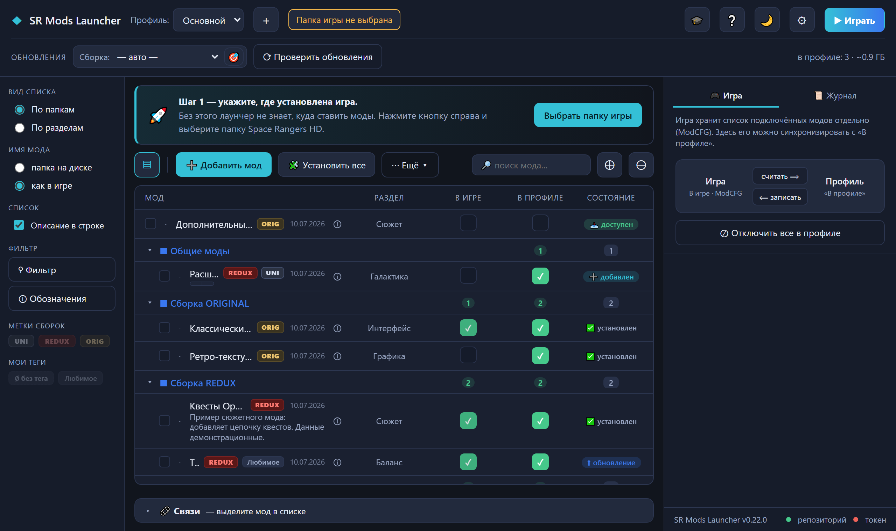
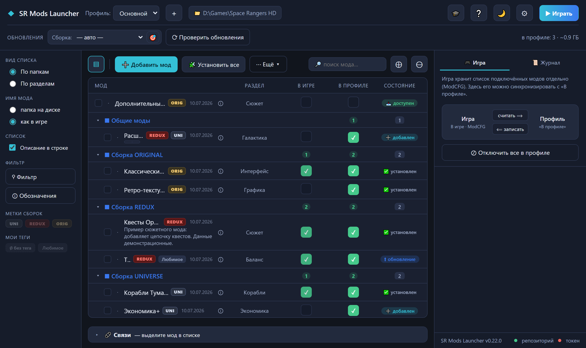
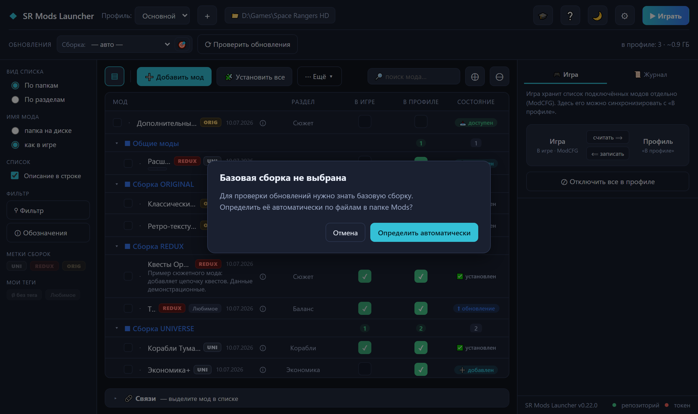
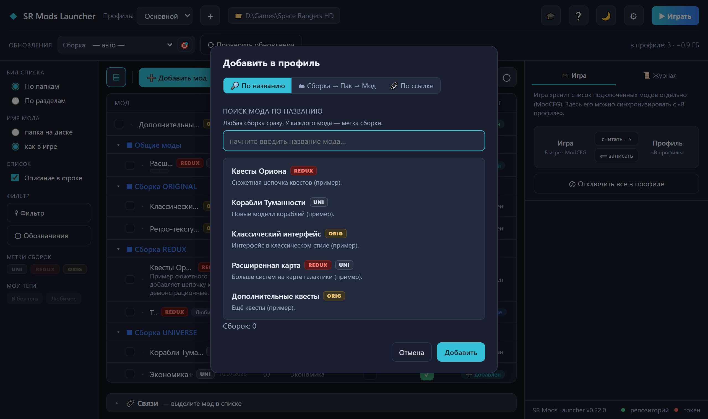
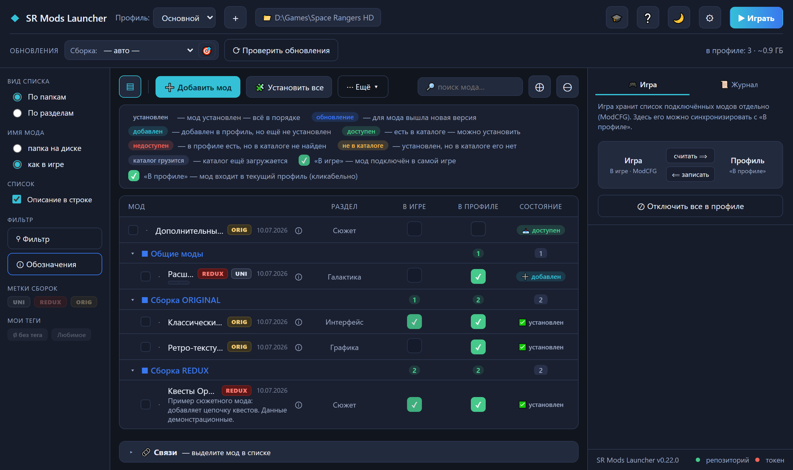
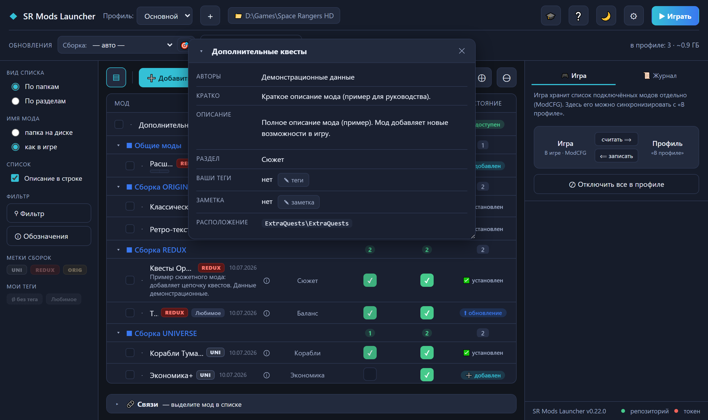
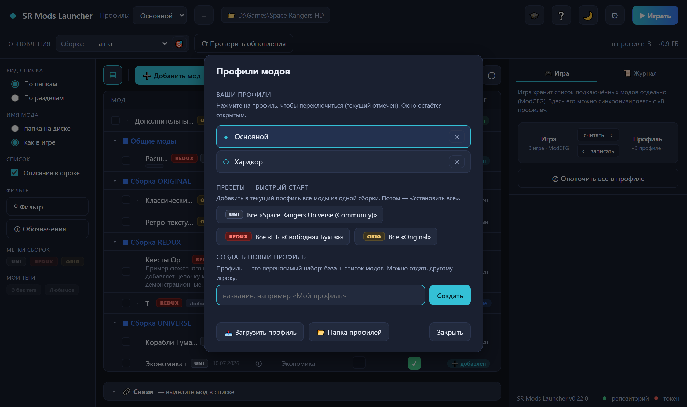
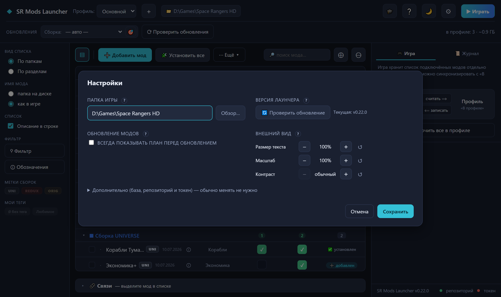
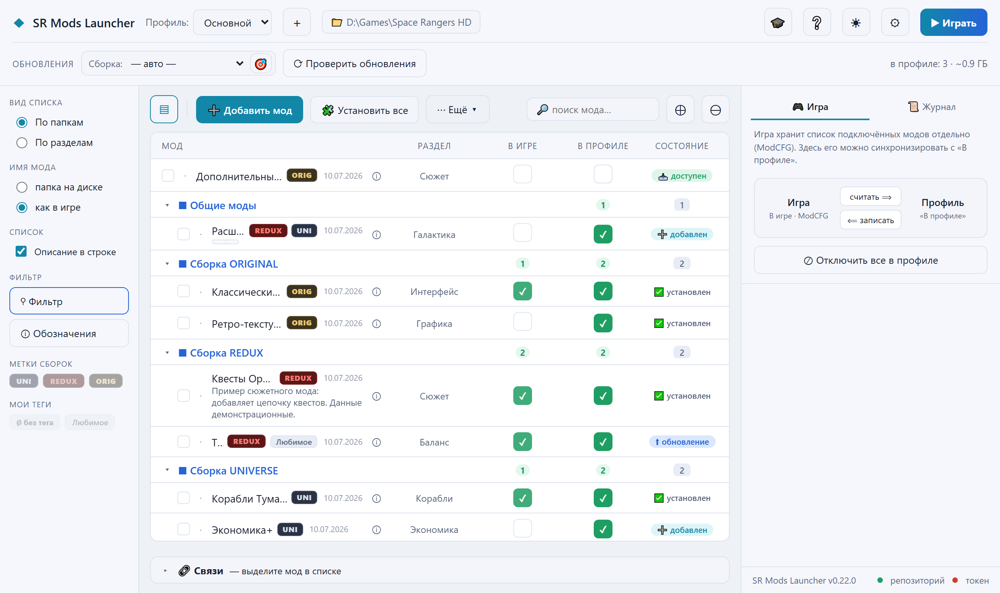

# SR Mods Launcher

Лаунчер модов для **Space Rangers HD**: помогает найти моды, скачать их, установить в игру
и держать в актуальном состоянии — без ручного копирования файлов и правки `ModCFG`.
Ставит и обновляет моды, показывает, что уже подключено в игре, сохраняет ваши сборки как
переносимые профили и запускает саму игру.

> **О сборках.** Лаунчер одинаково работает со всеми сообществами-сборками
> (**REDUX**, **UNIVERSE**, **ORIGINAL**) и не отдаёт предпочтения ни одной из них.
> Какую сборку и какие моды ставить — решаете только вы. На скриншотах ниже данные
> демонстрационные; моды и сборки показаны как равнозначные примеры.

> 📄 Совсем короткая шпаргалка — [ИНСТРУКЦИЯ-ПРОСТАЯ.md](ИНСТРУКЦИЯ-ПРОСТАЯ.md).
> Подробное руководство с разбором всех окон — [ИНСТРУКЦИЯ.md](ИНСТРУКЦИЯ.md).
> История версий (что менялось) — [CHANGELOG.md](CHANGELOG.md).

---

## С чего начать

1. **Установите Space Rangers HD** (например, из Steam) — моды ставятся в уже установленную игру.
2. **Скачайте лаунчер** — файл `SRModsLauncher.exe` со страницы
   [Releases](../../releases/latest). Это один самодостаточный файл, устанавливать ничего не нужно.
3. **Запустите `SRModsLauncher.exe`.** Нужен **Edge WebView2 Runtime** — на Windows 10/11 он есть
   штатно. Если антивирус придерживает `.exe`, в Releases рядом лежит архив с исходниками.

Лаунчер сам проверяет, не вышла ли его новая версия, и умеет обновиться в один клик —
следить за этим вручную не нужно.

---

## Шаг 1. Указать, где установлена игра

При первом запуске лаунчер спросит папку игры — без неё он не знает, куда ставить моды.
Нажмите **«Выбрать папку игры»** и укажите каталог Space Rangers HD (лаунчер попробует найти
установку Steam автоматически).



---

## Знакомство с окном

После выбора папки открывается главное окно.



- **Шапка (сверху).** Слева — текущий **профиль** (ваш набор модов) и путь к игре;
  справа — обучающий тур 🎓, справка ❔, переключатель темы 🌙/☀, настройки ⚙ и кнопка **▶ Играть**.
- **Строка «Обновления».** Здесь выбирается **базовая сборка** для проверки обновлений
  (по умолчанию — «— авто —», см. следующий раздел) и кнопка **«Проверить обновления»**.
- **Левая панель.** Вид списка (по папкам / по разделам), как показывать имя мода,
  фильтр и метки сборок (**UNI / REDUX / ORIG**) для быстрого отбора.
- **Список модов (центр).** Колонки: имя мода и его метка сборки, дата, раздел, а также
  три состояния — **В игре** (подключён ли мод в самой игре), **В профиле** (входит ли в
  ваш набор) и **Состояние** (установлен / есть обновление / доступен и т. п.).
- **Правая панель.** Вкладка **«Игра»** — синхронизация подключённых модов между игрой и
  профилем; вкладка **«Журнал»** — что делает лаунчер.

---

## Шаг 2. Базовая сборка (можно оставить «авто»)

Чтобы проверять обновления, лаунчер должен знать, на какой сборке вы играете. По умолчанию
стоит **«— авто —»**: сборка определяется сама по файлам в папке `Mods`. Если оставить авто и
нажать «Проверить обновления», лаунчер предложит определить сборку автоматически — просто
согласитесь. Выбрать сборку вручную тоже можно в списке «Сборка:».



---

## Шаг 3. Добавить моды

Нажмите **«➕ Добавить мод»**. Есть три способа:

- **По названию** — начните вводить имя, лаунчер покажет подходящие моды из каталога.
  У каждого мода видна метка сборки, которой он принадлежит.
- **Сборка → Пак → Мод** — выбрать из структуры каталога.
- **По ссылке** — добавить мод по прямой ссылке.



Выбранные моды попадают в ваш профиль со статусом **«➕ добавлен»** — это очередь на установку.

---

## Шаг 4. Установить

Нажмите **«🧩 Установить все»** — если ничего не отмечено галочками, установится весь профиль;
если отметить отдельные моды, установятся только они. Лаунчер скачает нужные файлы и разложит
их по игре так, как ожидает сама игра. Идёт индикатор прогресса, установку можно прервать.

Что означают значки состояния — подскажет кнопка **«ⓘ Обозначения»**:



---

## Карточка мода и связи

Значок **ⓘ** у строки открывает карточку мода: описание, автор, раздел, ваши теги и заметка,
а также **связи** — что мод требует, для чего он нужен и с чем конфликтует. Карточку можно
двигать, менять размер и держать несколько открытыми, чтобы сравнить моды. У мода, который есть
в нескольких сборках, здесь же переключаются **варианты** — вы сами выбираете, из какой сборки
взять мод.



---

## Проверить и установить обновления

Кнопка **«Проверить обновления»** сверяет файлы на диске с опубликованными версиями и помечает
моды значком **«⬆ обновление»**. Чтобы применить их, нажмите **«🔀 Обновить все»** — лаунчер
скачает новые версии и **постарается сохранить ваши ручные правки файлов** (несовпадающие места
покажет и даст выбрать: оставить своё, взять новое или сохранить оба). По правому клику на моде с
обновлением можно заранее **посмотреть план обновления** — какие файлы и откуда изменятся,
ничего при этом не устанавливая.

---

## Профили

**Профиль** — это переносимый набор: базовая сборка + список модов. Кнопка **＋** рядом с именем
профиля открывает управление: переключиться между профилями, создать новый, а также **пресеты
быстрого старта** — добавить в профиль сразу все моды одной из сборок (все сборки показаны
равнозначно). Готовый профиль (файл `.json`) можно отдать другому игроку, а через
**«Загрузить профиль»** — принять чужой.



---

## Настройки, темы и читаемость

Кнопка **⚙** открывает настройки: папка игры, проверка обновления лаунчера и раздел
**«Внешний вид»** — регуляторы **Размер текста / Масштаб / Контраст** (каждый со сбросом ↺).
Тему можно переключать и прямо из шапки кнопкой 🌙/☀.



Светлая тема выглядит так:



---

## Запустить игру

Когда моды установлены и подключены, нажмите **▶ Играть** в правом верхнем углу — лаунчер
запустит Space Rangers HD с вашим набором модов.

---

## Если что-то не так

- **Мод постоянно предлагает обновиться, а «Обновить» пишет «нечего обновлять».** Убедитесь,
  что выбрана правильная базовая сборка (или оставьте «— авто —» и определите её автоматически).
- **Антивирус блокирует `.exe`.** Скачайте из Releases архив с исходниками и запустите из них
  (см. раздел для разработчиков ниже).
- **Не открывается окно / белый экран.** Нужен **Edge WebView2 Runtime** — установите его с сайта
  Microsoft (на Windows 10/11 обычно уже есть).

Полный разбор всех окон и сценариев — в [ИНСТРУКЦИЯ.md](ИНСТРУКЦИЯ.md).

---

## Для разработчиков и опытных пользователей

<details>
<summary>Запуск из исходников, сборка .exe, тесты, форки</summary>

### Запуск из исходников

```
pip install -r requirements.txt pywebview
python webui/app.py            # --debug откроет инструменты разработчика
```

Актуальный интерфейс — на **pywebview + Edge WebView2**, исходники в каталоге **`webui/`**:
`app.py` (мост JS↔Python), `web/` (`index.html`/`style.css`/`app.js`), движок `launcher_core.py`.
Старый интерфейс на tkinter (`launcher.py`) оставлен как legacy.

### Сборка .exe (Windows)

Из **корня репозитория**, при закрытом exe:

```
cd webui
python -m PyInstaller --clean --noconfirm SRModsLauncher.spec
```

Результат: `webui\dist\SRModsLauncher.exe` — самодостаточный файл (~11 МБ), требует
Edge WebView2 Runtime. Скриншоты для этого README генерируются скриптом
`webui/make_readme_shots.py` (Playwright + мок-данные, без сети и реальных модов).

### Тесты

```
python webui/test_ui_logic.py       # логика (без диска и сети)
python webui/test_integration.py    # интеграция (реальный диск + мок сети)
```

Оба запускаются напрямую (без pytest), пишут `[OK]`/`[FAIL]` и возвращают ненулевой код при провалах.

### Каталог модов и форки

Основной репозиторий модов — **публичный**: лаунчер читает каталог и манифесты с
`raw.githubusercontent.com` без токена. Ассеты хранятся на Hugging Face (тоже публично). Токен в
настройках нужен только для приватного репозитория/форка.

В Настройки ⚙ → «Дополнительно» можно добавить **дополнительные репозитории (форки)**: они
накладываются поверх основного каталога **пофайлово** (форк не вводит новые моды, а заменяет или
дополняет файлы существующих). Так доставляются, например, хотфиксы к модам.

### Структура

```
webui/app.py            мост JS↔Python (pywebview) поверх launcher_core
webui/web/              фронт: index.html, style.css, app.js
webui/SRModsLauncher.spec   сборка .exe (PyInstaller)
launcher_core.py        движок: GitHub/HF, скачивание, профили, резолвер, merge
launcher.py             старый GUI (tkinter), legacy
ИНСТРУКЦИЯ.md           подробное руководство игрока
ИНСТРУКЦИЯ-ПРОСТАЯ.md   короткая шпаргалка
CHANGELOG.md            история версий
```

</details>
